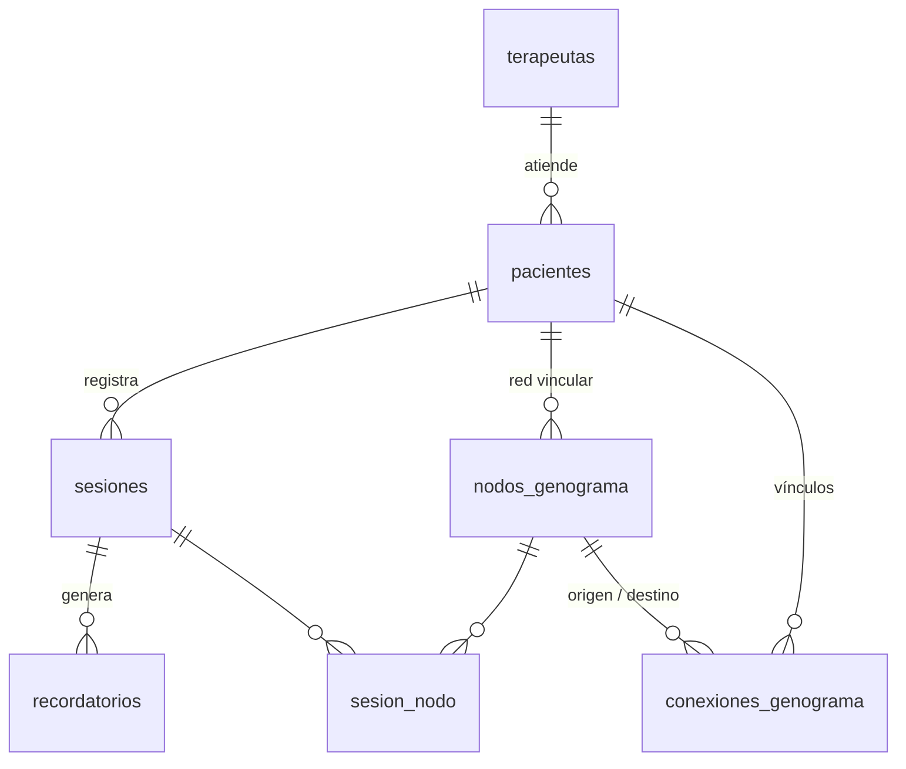

# Modelo de datos

Fuente de verdad: `apps/api/app/models/`. Migración inicial:
`apps/api/alembic/versions/20260803_1200_3f8c1d9a2b47_esquema_inicial.py`.

## Diagrama

## Tablas

| Tabla | Rol |
|---|---|
| `terapeutas` | Raíz del multi-tenant. Sin auth todavía; el MVP usa un terapeuta seed. |
| `pacientes` | Cuelga de `terapeutas`. |
| `sesiones` | Notas crudas + salida de IA + tags + trazabilidad del procesamiento. |
| `recordatorios` | Alertas para la próxima sesión, con estado `resuelto`. |
| `nodos_genograma` | Cada persona de la red vincular, con su posición en el canvas. |
| `conexiones_genograma` | Los edges: tipo estructural + calidad emocional del vínculo. |
| `sesion_nodo` | M2M sesión ↔ persona. Habilita "tocar un nodo y filtrar el historial". |

## Decisiones y por qué

**`recordatorios` es tabla, no JSONB dentro de `sesiones`.** Tienen estado mutable
(`resuelto`) y la consulta real es "qué me quedó pendiente con este paciente",
cruzando todas sus sesiones. Mutar e indexar el estado de un elemento dentro de un
array JSONB sería dolor evitable. Todo lo que no tiene estado sí va en JSONB
(`pacientes.datos`, `nodos_genograma.datos`, `sesiones.ia_payload`).

**`sesiones.tags` es `TEXT[]` con índice GIN, no una tabla normalizada.** Cubre el
filtro (`tags && ARRAY['ansiedad']`) y la nube de tags (`unnest` + `count`) sin
joins. Si más adelante los tags necesitan color o descripción se normaliza sin
romper el contrato de la API.

**`sesion_nodo` no se expone como `Relationship(link_model=...)`.** La fila lleva
datos propios (`menciones`, `contexto`) que una relación `secondary` no sabe
escribir, y tener las dos cosas mapeando la misma tabla dispara los warnings de
*overlapping relationships* de SQLAlchemy. El servicio la usa de forma explícita.

**Enums como `VARCHAR` + `CHECK`, no tipos ENUM nativos.** Agregar un valor a un
ENUM nativo requiere `ALTER TYPE`, que no es transaccional y complica los
downgrades. Con `CHECK` es un cambio de constraint común y corriente. Se persiste
el **valor** del enum (`"activo"`), no su nombre, para que lo guardado coincida con
lo que expone la API. Ver `tipo_enum()` en `app/models/base.py`.

**`conexiones_genograma.paciente_id` está denormalizado.** Permite traer el grafo
completo del paciente en una sola query, sin joins contra `nodos_genograma`. Lo
mismo con `recordatorios.paciente_id`.

**`UniqueConstraint(paciente_id, etiqueta)` en `nodos_genograma`.** Es lo que
permite que la extracción de entidades haga *upsert* por etiqueta en lugar de crear
una "Mamá" nueva cada vez que se procesa una sesión.

## Índices

| Índice | Para qué |
|---|---|
| `ix_sesiones_paciente_fecha` | Historial del paciente, más reciente primero. Cubre también las búsquedas por `paciente_id` solo, por eso esa columna no lleva índice propio. |
| `ix_sesiones_tags` (GIN) | Filtro temático por tags. |
| `ix_sesiones_fts` (GIN) | Búsqueda full-text en español sobre `resumen_ia` + `notas_borrador`. |
| `ix_recordatorios_pendientes` | Índice parcial `WHERE resuelto = false`. |
| `ix_sesion_nodo_nodo_id` | "Sesiones donde aparece este nodo" (la PK cubre la dirección inversa). |

`ix_sesiones_fts` se crea con `op.execute` y está listado en `INDICES_MANUALES` de
`alembic/env.py`: el autogenerate no compara índices de expresión de forma estable
y, sin esa exclusión, intentaría borrarlo en cada migración nueva.

## Al agregar autenticación

`hashed_password` entra en `terapeutas` y nada más cambia de estructura: `pacientes`
ya cuelga de esa tabla. Lo que sí hay que hacer es filtrar por `terapeuta_id` en
todos los endpoints, o mover el aislamiento a Row Level Security de Postgres.
